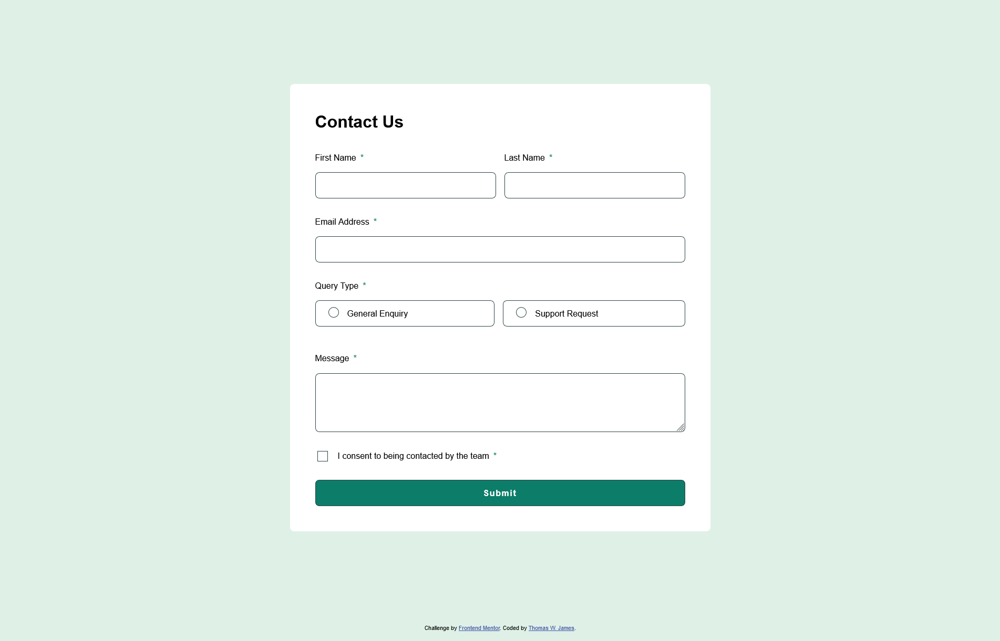
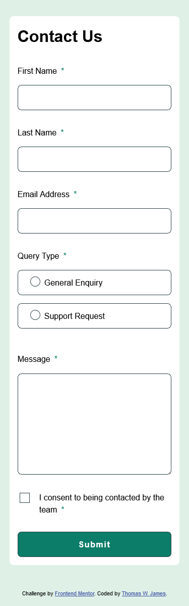

# Frontend Mentor - Contact form solution

This is a solution to the [Contact form challenge on Frontend Mentor](https://www.frontendmentor.io/challenges/contact-form--G-hYlqKJj). Frontend Mentor challenges help you improve your coding skills by building realistic projects. 

## Table of contents

- [Overview](#overview)
  - [The challenge](#the-challenge)
  - [Screenshot](#screenshot)
  - [Links](#links)
- [My process](#my-process)
  - [Built with](#built-with)
  - [What I learned](#what-i-learned)
  - [Continued development](#continued-development)
  - [Useful resources](#useful-resources)
- [Author](#author)

**Note: Delete this note and update the table of contents based on what sections you keep.**

## Overview

### The challenge

Users should be able to:

- Complete the form and see a success toast message upon successful submission
- Receive form validation messages if:
  - A required field has been missed
  - The email address is not formatted correctly
- Complete the form only using their keyboard
- Have inputs, error messages, and the success message announced on their screen reader
- View the optimal layout for the interface depending on their device's screen size
- See hover and focus states for all interactive elements on the page

### Screenshot

#### Desktop

#### Mobile


### Links

- Solution URL: [https://github.com/turtlethom/contact-form](https://github.com/turtlethom/contact-form)
- Live Site URL: [https://turtlethom.github.io/contact-form/](https://turtlethom.github.io/contact-form/)

## My process

### Built with

- Semantic HTML5 markup
- CSS custom properties
- CSS Grid
- CSS Animations
- Vanilla JavaScript
- Flexbox

**Note: These are just examples. Delete this note and replace the list above with your own choices**

### What I learned

#### Interacting With The DOM using JavaScript

Although I have used Vite/React for other front-end projects, I wanted to focus more on understanding how vanilla JavaScript works for web development, without hiding anything under a layer of abstraction.
- I discovered how to use Element Selectors that come predefined on the `document` object, such as `querySelector`, `querySelectorAll`, and `getElementById`.
- I learned about properties on the elements that could be accessed on elements such as `element.checked`.
- I had to learn about different events (other than `click` events) such as `focus`, `input`, `blur`, `change`. Utilizing these events and listening for them on specific elements was very interesting (and dare I say fun to learn!)

This project helped with tremendously in building vanilla front-end projects more intuitively. Although there is still plenty of room for improvement, I am becoming more comfortable writing Javascript code:

```javascript
/* Selecting Form Element */
const form = document.getElementById('contact-form');

/* Grabbing Form Input Elements */
const firstNameInput = document.getElementById('first-name');
const lastNameInput = document.getElementById('last-name');
const emailInput = document.getElementById('email');
const queryTypeInputs = document.querySelectorAll('input[name="query-type"]');
const messageInput = document.getElementById('message');
const termsInput = document.getElementById('terms');

/* Selecting All Text Inputs */
const textInputs = document.querySelectorAll('input[type="text"]');
const allTextInputs = [...textInputs, messageInput];

/* Selecting Success Message */
const successMessage = document.getElementById('success-message');
```

#### Utilizing CSS Animations & Advanced CSS Grid

I used to only use `CSS Flexbox` exclusively for projects, as it was very intuitive and easy to use. However, I knew that `CSS Grid` came loaded with powerful features. In this project, I tried to push myself out of my comfort zone.
- Instead of using `grid-template-columns` and `grid-template-rows`, I used `grid-template-areas`. I found this a very exciting feature and definitely recommend using it in responsive layouts.
- I looked into and became more knowledgeable of `min-content`, `max-content`, and `auto`. I have yet to use `auto-fill` and `auto-fit` for my grids (as well as `minmax()`).

```css
.form {
    --column-gap: 1rem;
    --row-gap: 2rem;

    border: none;
    width: min(50rem, 90%);
    row-gap: var(--row-gap);
    column-gap: var(--column-gap);
    padding: var(--form-pad);
    /* margin-block: 2rem; */
    margin: 10rem;
    font-weight: var(--fw-400);

    grid-template-areas: 
    "fh fh"
    "fn ln"
    "ea ea"
    "qt qt"
    "mg mg"
    "tm tm"
    "bt bt";
}

#form-heading-wrapper { grid-area: fh; }
#first-name-wrapper { grid-area: fn; }
#last-name-wrapper { grid-area: ln; }
#email-wrapper { grid-area: ea; }
#query-type-wrapper { grid-area: qt; }
#message-wrapper { grid-area: mg; }
#terms-wrapper { grid-area: tm; }
#submit-btn-wrapper { grid-area: bt; }
```

Creating a CSS Animation to make the Success Message of my contact form more engaging was quite fun.
- Although not a requirement, I wanted to make it appear and disappear with this animation:

```css
@keyframes opacityOnAndOff {
    0% {
        top: -15%;
        opacity: 0;
    }
    30%{
        top: 0;
      opacity: 1;
    }
    100% {
        top: -20%;
        opacity: 0;
    }
}
```

#### Improving on Modularizing Code
I am starting to compartmentalize certain functionality in JS and CSS to avoid repeating myself and bloating the codebase. I've tried to condense the amount of hard coding the main entry points of my program files.
- For JavaScript, I felt it was more clear for me to define my **Event Handler Functions**, as well as any other helper functions before the main code.
- For CSS, I would use more variables to pre-define style values I felt were being repeated. (I also like changing a variable in one place to affect the code everywhere else.)

```css
    /* Misc */
    --border-rad: 0.5rem;
    --pad-block: 0.75rem;
    --form-pad: 3rem;
```

OR

```javascript
/* Event Handling Functions */
/* Handler Functions For `On Change` */
function handleOnQueryChange(event) {
    // Iterate over each query type input
    queryTypeInputs.forEach(input => {
        if (input.checked) {
            input.parentElement.classList.add('active');
        }
        else {
            input.parentElement.classList.remove('active');
        }
    })
}
/* ============================= */
/* Handler Functions For `Focus` */
function handleOnTextFocus(event) {
    event.target.classList.add('active');
}

/* Etcetera etcetera... */
```

### Continued development

The main things I want to improve on are the **form validation aspects** of this project, more specifically the email field. I've create some validation such as:
- Allow alphanumeric/non-alphanumeric characters where appropriate.
- Utilize valid domain extensions such as `.com`, `.net`, `.co`. I also want to validate if the emails exist, but that seem's like quite a complex task.

I've been able to create some rules where only `.`, `_`, and `-` are allowed, restricted from being the last character in the email prefix.
- However, I want to prevent **repeating ALLOWED non-alphanumeric** characters. (`--`)

These are some areas I believe can use some improvement to make this contact form useful as a template for my other projects.

I definitely am always looking to improve anywhere when it comes to **accessibility**. This is one of the main areas in which I struggle!

### Useful resources

- [Opacity Animation - Jack Moody](https://stackoverflow.com/questions/48174797/use-css-to-make-object-appear-then-after-delay-make-it-disappear)
- [Allowable Non-AlphaNumeric Characters - Michael Martin-Smucker](https://stackoverflow.com/questions/4434076/best-way-to-alphanumeric-check-in-javascript) - I had to do some research on how to create an opacity animation as well as allow certain characters within my email validation tests. I'd love to thank **Michael** and **Jack** on **StackOverflow** for the great solutions that helped me finish this project.
- [Email Conventions](https://help.xmatters.com/ondemand/trial/valid_email_format.htm) - This resource helped me create some validation tests and visualize some example conventions that would or would not pass as valid emails.

## Author

- Frontend Mentor - [@turtlethom](https://www.frontendmentor.io/profile/turtlethom)
- Twitter - [@wjamesthomas3](https://www.twitter.com/wjamesthomas3)
